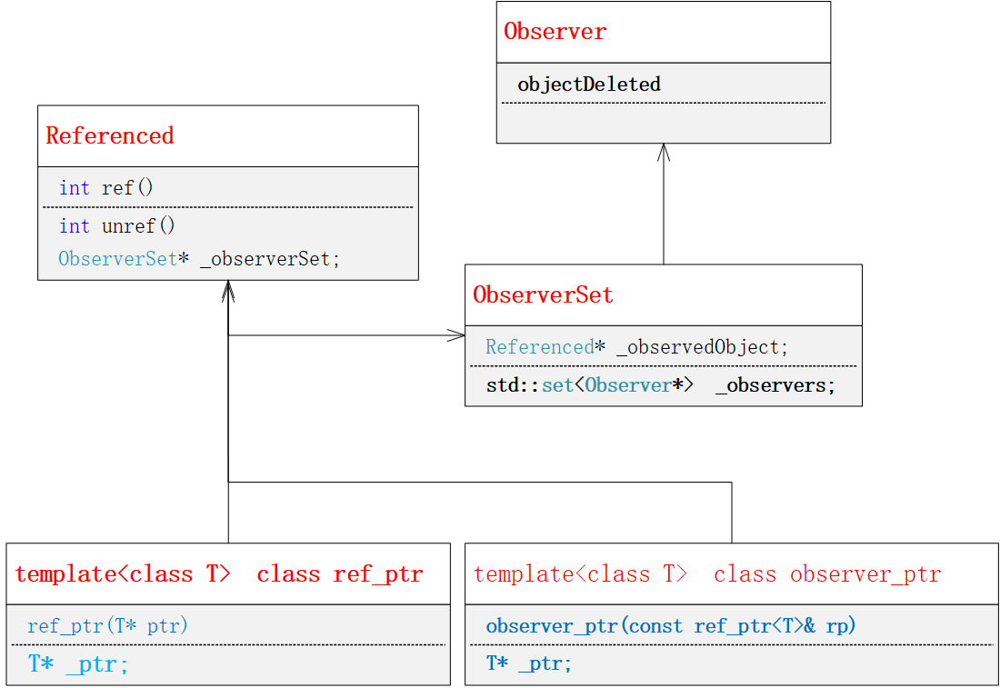
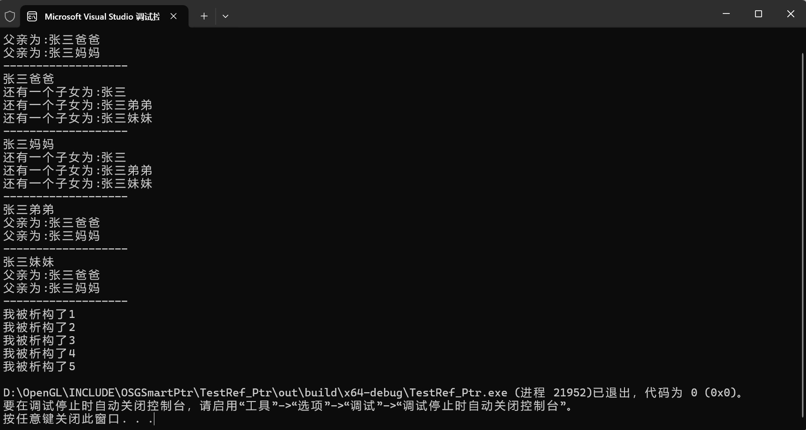
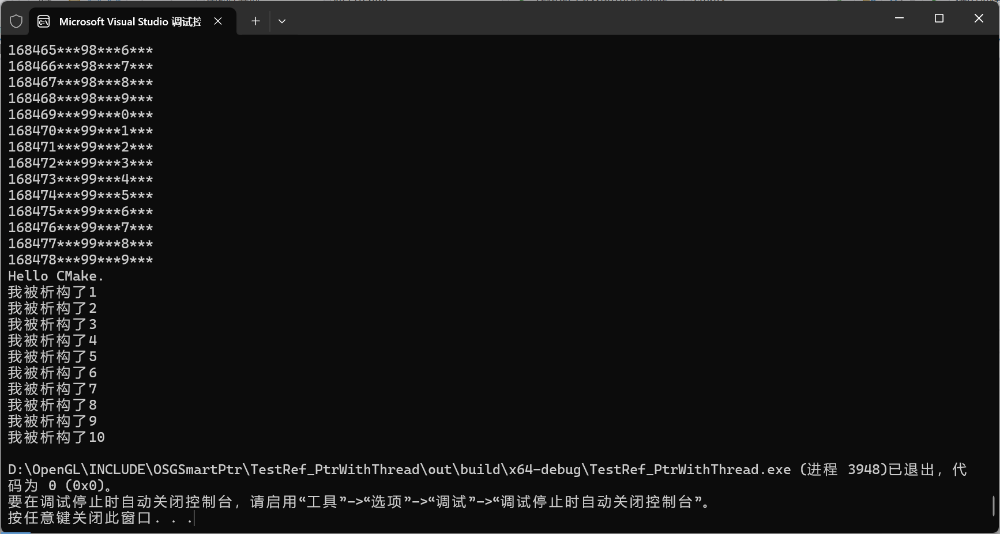

<h1 align="Center"><font color=#ee7707;>开源一个线程安全的智能指针</font></h1>
<h2 align="Center"><font face="华文行楷" color="Blue">开发者：刘文庆</font></h2>

​          本程序开源地址 ：https://github.com/opengvs/ref_ptr   和 https://gitee.com/opengvs/ref_ptr

​         <font color="Red">ref_ptr智能指针</font>最初时十年前作者从[OSG(OpenSceneGraph)](https://github.com/openscenegraph/OpenSceneGraph) 中抠出来的，主要是替换std::auto_ptr，并且提供多线程安全的处理机制，经过几个项目应用，起到了较为满意的效果。几个月前接触到现代C++11、14、17、20提供的std::unique_ptr和std::share_ptr/std::weak_ptr，通过一篇《再次谈谈C++语言中的智能指针》文章分析了现在C++中智能指针的线程安全性，闲下来翻阅以前的代码，感觉从简洁性上自己开发的ref_ptr智能指针较为简单点，如果应用到项目中，出现问题可能更好调试。基于此作者对ref_ptr智能指针源代码做了再次修改，主要体现在将std::mutex互斥量同步方式，改为基于std::atomic_flag原子类型的自旋锁SpinLock同步和std::atomic原子计数器实现线程安全。

​       <font color="Red">ref_ptr智能指针</font>仅仅包含两个头文件[ref_ptr.hpp](../cppCode/ref_ptr.hpp)和[References.hpp](../cppCode/References.hpp)。不依赖任何第三方库，仅仅需要C++11标准支撑就可以了。为了感谢OSG系统的辛勤付出，作者将<font color="Red">ref_ptr智能指针</font>命名空间保留为osg::ref_ptr。使用中仅仅包含#include<ref_ptr.hpp>就可以了。下面详细介绍一下ref_ptr智能指针的程序结构及使用方法 。

​      作者重新设计了ref_ptr智能指针的类结构，其类层次结构如下：




​     OSG系统中ObserverSet类设计为Referenced的派生类，确实Referenced中的方法Ref(）、unref(）、unref_nodelete(）三个方法是在ObserverSet中必须的。但是考虑到类层次结构清晰性，作者将ObserverSet类独立出来，因为Referenced类需要拥有一个ObserverSet类对象，用于生成对象的观察者Observer对象，而ObserverSet类成员中又需要指引一个Referenced被观察对象的指针，所以将他们之间的派生关系去除，单独实现ObserverSet类中的Ref(）、unref(）、unref_nodelete(）函数，这样类层次关系就清晰了。

​     另外，ObserverSet和Observer类，仅仅在Referenced类中使用，不牵涉派生类，作者将这两个类中的虚析构函数改为实析构函数。

​     为保证ref_ptr智能指针在本身操作过程中的线程安全性，我们再Referenced.hpp头文件中定义了_USE_ATIMIC_REFCOUNT_宏，通过该宏定义用户自行决定时候使用原子计数器：

```
#ifndef _USE_ATIMIC_REFCOUNT_
        mutable unsigned long    _refCount = 0;
#else
        mutable    std::atomic<unsigned long>                 _refCount; // 定义一个原子整数计数器
#endif
```

​        当使用原子计数器时，Ref(）函数就没有必要使用多线程同步机制了。

​        即使在使用原子计数器情况下，为保证线程安全我们再Referenced类和ObserverSet类中设计了mutable std::atomic_flag _refAtomicLock = ATOMIC_FLAG_INIT;自旋锁成员，通过空定义实现了函数操作的多线程互斥访问。

```
        mutable std::atomic_flag _refAtomicLock = ATOMIC_FLAG_INIT;
#define  refAtomicLockLOCK_BEGIN    while (_refAtomicLock.test_and_set(std::memory_order_acquire)) ;
#define  refAtomicLockLOCK_END    _refAtomicLock.clear(std::memory_order_release);

 mutable std::atomic_flag _refAtomicLock = ATOMIC_FLAG_INIT;  //初始化原子布尔类型
#define  observerAtomicLockLOCK_BEGIN    while (_refAtomicLock.test_and_set(std::memory_order_acquire)) ;
#define  observerAtomicLockLOCK_END    _refAtomicLock.clear(std::memory_order_release);

```

​      关于智能指针设计的相关知识不是本文的主要论述点，有兴趣儿的读者可以参阅https://blog.csdn.net/EWIAW_ilove/article/details/144796343相关博客的技术文章。这里作者主要描述一下<font color="Red">ref_ptr智能指针</font>的测试情况与使用方法：

​    TestRef_Ptr工程主要测试ref_ptr指针与observer_ptr指针配合解决智能指针的循环引用问题，我们设计了一个家庭成员的父母与子女的关系结构的Person类:

```C++
class  Person : public osg::Referenced
{
    int* p;
public:
    osg::ref_ptr<Person>  m_Father;
    osg::ref_ptr<Person>  m_Mather;
    vector<osg::observer_ptr<Person>> m_Childen;
    string  Name;
    Person()
    {
        p = new int[10];
    }

    virtual ~Person()
    {
        delete[]p;
        static int i = 1;
        std::cout << "我被析构了" << i++ << std::endl;
    }
    void SetName(const string _Name)
    {
        Name = _Name;
    }
    void SetFather(osg::ref_ptr<Person>& father)
    {
        m_Father = father;
    }
    void SetMather(osg::ref_ptr<Person>& mather)
    {
        m_Mather = mather;
    }
    void AddChild(osg::observer_ptr<Person>& child)
    {
        m_Childen.push_back(child);
    }
    void AddChild(osg::ref_ptr<Person>& child)
    {
        osg::observer_ptr<Person> child_ptr = child;
        m_Childen.emplace_back(child_ptr);
    }
};
std::list<osg::ref_ptr<Person>>  g_PersonList;
```

​    Person类中通过osg::ref_ptr<Person>类指向父亲和母亲，如果其有子女通过vector< osg::observer_ptr<Person > > m_Childen;列表指向子女。这样就避免了智能指针的循环引用问题问题。

<font color="Red">注意：osg::observer_ptr< Person >类对象包含了一个其所观察的对象Referenced指针，可以通过Referenced* getObserverdObject()函数得到并直接使用。建议在实际使用时使用 bool lock(ref_ptr<T>& rptr) const 函数，判断是否成功后通过rptr返回参数进行使用，实例代码如下：</font>

```
osg::observer_ptr<Person> ObserverPerson_Ptr = *pIt1;

osg::ref_ptr< Person >  tempChild;
if (ObserverPerson_Ptr.lock(tempChild) == true)
if(tempChild != nullptr)
{
    cout << "还有一个子女为:" << tempChild->Name << endl;
}
```

测试主程序代码：

```
int main()
{
    osg::ref_ptr<Person>  person = new Person();
    person->SetName("张三");

    osg::ref_ptr<Person>  farther = new Person();
    farther->SetName("张三爸爸");

    osg::ref_ptr<Person>  mather = new Person();
    mather->SetName("张三妈妈");
 
    osg::ref_ptr<Person>  brother = new Person();
    brother->SetName("张三弟弟");
    brother->m_Father = farther;
    brother->m_Mather = mather;

    osg::ref_ptr<Person>  brother1 = new Person();
    brother1->SetName("张三妹妹");
    brother1->m_Father = farther;
    brother1->m_Mather = mather;

    person->m_Father = farther;
    person->m_Mather = mather;

    farther->AddChild(person);
    farther->AddChild(brother);
    farther->AddChild(brother1);

    mather->AddChild(person);
    mather->AddChild(brother);
    mather->AddChild(brother1);

    g_PersonList.push_back(person);
    g_PersonList.push_back(farther);
    g_PersonList.push_back(mather);
    g_PersonList.push_back(brother);
    g_PersonList.push_back(brother1);

    auto pIt = g_PersonList.begin();

    while(pIt != g_PersonList.end() )
    {
        cout << (*pIt)->Name << endl;
        osg::ref_ptr<Person> Ref_Person = *pIt;
        if (Ref_Person->m_Father != nullptr)
        {
            cout << "父亲为:"<< Ref_Person->m_Father->Name << endl;
        }
        if (Ref_Person->m_Mather != nullptr)
        {
            cout << "父亲为:" << Ref_Person->m_Mather->Name << endl;
        }
        auto  pIt1 = Ref_Person->m_Childen.begin();
        while (pIt1 != Ref_Person->m_Childen.end())
        {
            osg::observer_ptr<Person> ObserverPerson_Ptr = *pIt1;

            osg::ref_ptr< Person >  tempChild;
            if (ObserverPerson_Ptr.lock(tempChild) == true)
            if(tempChild != nullptr)
            {
                cout << "还有一个子女为:" << tempChild->Name << endl;
            }
            pIt1++;
        }
        cout << "-------------------" << endl;
        pIt++;
    }

	return 0;
}
```

程序运行结果为：



测试用例二：

​        本用例在测试用例基础上增加了多线程测试的代码：

```C++
//Person 内部
int Add(int i)
{
    if ((i >= 0) && (i < 10))
    {
        p[i]++;
    }
    int total = 0;
    for (int j = 0; j < 10; j++)
    {
        total += p[j];
    }
    return total;
}
thread   ComputeWithThread;
void  JoinComputeThread()
{
    if(ComputeWithThread.joinable() == false)
            ComputeWithThread = thread(TestPrintPerson, this);
    ComputeWithThread.join();

}

//Person外部函数
void TestPrintPerson(void* p)
{
    osg::ref_ptr<Person>  pPerson = (Person*)p;
    for (int i = 0; i < 10; i++)
    {
        pPerson->Add(i);
    }
    for (int j = 0; j < 100; j++)
    {
        for (int i = 0; i < 10; i++)
        {
            printf("%d***%d***%d***\n", pPerson->Add(i), j, i);
        }
        ::_sleep(1);
    }
}
```

程序运行结果：

